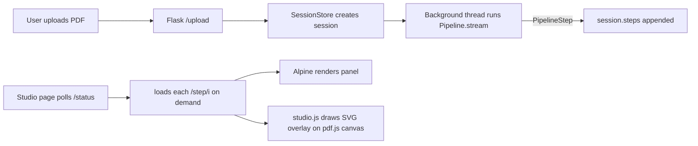

# docomestria-studio

> Interactive visual viewer for [docomestria](https://github.com/MrGo2/docomestria) — watch PDF extraction happen in real time.


## What it does

Upload a PDF and watch each phase of the docomestria pipeline run, step by
step: text extraction, semantic analysis, visual structure detection, fusion,
the LLM call, provenance binding, and final typing. Every step highlights the
bboxes it touched directly on top of the PDF, color-coded by engine.

Built for non-technical audiences — sales demos, training, debugging
extraction issues without reading logs.

## Setup

```bash
pip install docomestria-studio
export OPENROUTER_API_KEY=sk-or-v1-...
docomestria-studio
# opens on http://127.0.0.1:5050
```

By default it uses `google/gemini-2.5-flash-lite` via OpenRouter. Override with
`OPENROUTER_MODEL=<slug>` if you want a different model.

If `OPENROUTER_API_KEY` is missing the server still starts — uploads return a
friendly setup-required message until you set the key.

## Who it's for

- **Non-technical users** who want to see what the extraction pipeline does.
- **Sales demos** for clients evaluating docomestria as a backend.
- **Training material** to explain document understanding to operations teams.
- **Debugging** when a field comes out wrong — step through the pipeline and
  see exactly which engine and which bbox each value came from.

## Architecture



- **Backend:** Flask, in-memory session store, daemon thread runs
  `Pipeline.stream()` to completion before the user steps through it.
- **Frontend:** htmx (poll), Alpine.js (state), Tailwind CSS (styles),
  pdf.js (rendering). No Node, no buildchain, all via CDN.
- **Deploy:** local-only — `python app.py` is the supported flow.

## Endpoints

| Method | Path | Purpose |
|--------|------|---------|
| GET | `/` | Landing + upload page |
| POST | `/upload` | Accept a PDF, create a session, redirect to viewer |
| GET | `/studio/<id>` | Interactive viewer |
| GET | `/api/session/<id>/status` | `{status, steps_done, steps_total}` |
| GET | `/api/session/<id>/step/<i>` | Serialized step JSON |
| GET | `/api/session/<id>/pdf` | Raw PDF bytes (for pdf.js) |
| POST | `/api/session/<id>/reset` | Drop session |

## Configuration

| Env var | Default | Meaning |
|---------|---------|---------|
| `OPENROUTER_API_KEY` | _(required)_ | OpenRouter API key |
| `OPENROUTER_MODEL` | `google/gemini-2.5-flash-lite` | Model slug |
| `STUDIO_HOST` | `127.0.0.1` | Bind host |
| `STUDIO_PORT` | `5050` | Bind port |
| `STUDIO_UPLOAD_MAX_MB` | `20` | Max upload size |
| `STUDIO_DEBUG` | `false` | Flask debug mode |
| `STUDIO_SESSION_TTL_MIN` | `60` | Session TTL for cleanup |

## Related projects

- [`docomestria`](https://github.com/MrGo2/docomestria) — the underlying
  extraction pipeline (LiteParse + Docling + pdfplumber + LLM).

## License

MIT — see [LICENSE](LICENSE).
